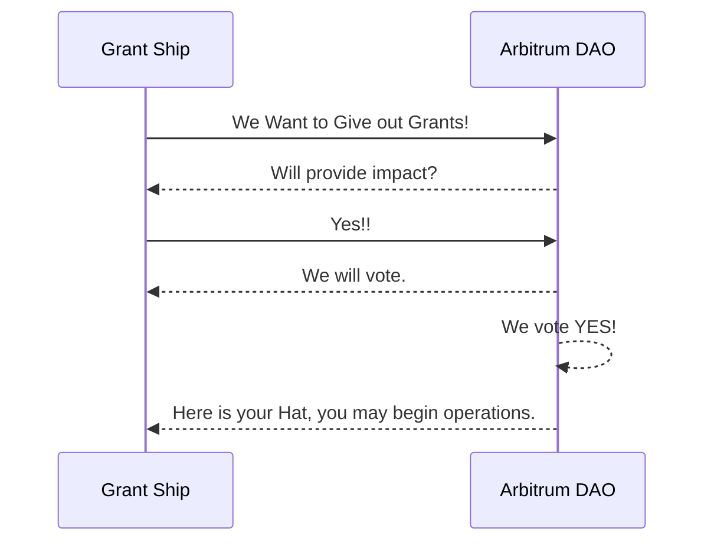

# Grant Ships Whitepaper

`Vol 1.1`
`Oct 31 2023`

## Abstract

Grant Ships is an evolutionary grants game designed to incentivize and streamline the allocation of community funding within the Arbitrum ecosystem. This document aims to provide a comprehensive understanding of the game mechanics, structural setup, and technical aspects of Grant Ships. 

## Table of Contents

1. [Abstract](#abstract)
2. [Introduction](#introduction)
3. [Purpose](#purpose)
4. [How The Game Works](#how-the-game-works)
    - [Game Structure & Players](#game-structure--players)
5. [Game Process](#game-process)
6. [Vote Modifier Module](#vote-modifier-module)
7. [Technical Architecture](#technical-architecture)
8. [Legal & KYC Concerns](#legal--kyc-concerns)
9. [Funding](#funding)
10. [Team](#team)
11. [Roadmap](#roadmap)
12. [Conclusion](#conclusion)

---
 
## Introduction

The concept of decentralized governance has evolved rapidly, leading to innovative frameworks for community engagement and resource allocation. One such advancement is Grant Ships, a game designed to improve the effectiveness and inclusivity of decentralized governance. This whitepaper outlines the architecture, core features, and unique mechanics that make Grant Ships a pioneering approach to decentralized grant allocation.

This paper will take you through the reason Grant Ships was created, the tools that are used to play the game and who plays the game. At time of writing, Grant Ships is still being developed on the implementation side and this document will take you through our development roadmap as well as our implementation plan.

## Purpose

The overarching goal of Grant Ships is to create a self-sustaining, community-driven grant allocation system that operates without the need for centralized control. By incorporating gamification elements, the project aims to promote a more inclusive governance model while enhancing awareness of various initiatives within the Arbitrum ecosystem. The long-term vision is to establish a system so efficient that it can run autonomously, guided only by community inputs.

## web3 Grants

Web3 has consistently recognized the value and importance of grant programs, as evidenced by its enduring tradition of offering these programs to bolster the open web’s legion of enthusiastic contributors: these include open-source developers, researchers, and thought leaders. These grants have been vital in keeping the innovative spirit of open source vibrant, fostering collaboration over competition, and providing pivotal onboarding tools for expanding ecosystems.

Grants programs have always been intrinsic to the web3 community, exemplifying how blockchain protocols actively solicit project proposals that augment their ecosystems. This can range from intricate technical enhancements to community-driven content such as podcasts and newsletters. The primary aim remains constant: to fortify web3, making it more resilient, collaborative, and capable of inspiring other protocols. Notable among these grants programs are the Uniswap Grants Program, which commenced following a policy proposal in 2020 advocating for recurring grants as a growth catalyst; Gitcoin Grants, which introduced the world to Quadratic Voting whith matching pools which have had a huge impact in the growth of the ecosystem, and grant DAOs such as Meta Cartel which consists of web3 enthuiasts who choose to pool some funds and support projects through grants.

Grant Ships' designers have watched and been closely involved in the space over the last few years. We have touched on many of the points that work in the grant landscape and have made improvements in order to find the project that offer the highest impact for the Arbitrum ecosystem and DAO.


## Grant Ships Genesis

## How The Game Works

### Tools

The following are the tools used to integrate with the game and the reason we use them. The Grant Ships front end

#### Allo Protocol

[Allo Protocol](https://allo.gitcoin.co/), part of the Gitcoin Grant Stack [^bignote] is a set of smart contracts that provide efficient and transparent capital allocation and distribution.

All ships in the game are registered though Allo which allows them to participate in the distribution of the funding pools created by Grant Ships and allocated to the game by Arbitrum DAO.

Allo includes the voting modules that Grant Ships uses in order for Arbitrum DAO to participate in the funding allocations to ships.

#### Hypercerts

[Hypercerts](https://hypercerts.org/) are semi-fungible ERC1155 tokens desinged to track impact through a unique handling of NFT metadata. They allow impact to be tracked and accumulated which makes it a perfect fit for Grant Ships, which rely's on tracking the impact that a ship is providing. This has a direct bearing on the funding a ship can recieve so it is in a ships best interest to provide impact to the ecosystem.

#### Hats Protocol

[Hats Protocol](https://www.hatsprotocol.xyz/) is a tool that enables onchain revokable roles. This empowers people (or in some cases code) to get the job done. Hats protocol is used throughout Grant Ships in the following ways:

- `Arbitrum DAO` will be the holder of the "Top Hat". This the main Hat of the game of which all others are its subordinate.
- `Grant Ships` are given a Hat from the DAO. This hat enables the Grant Ship to be funded in subsequent allocation seasons. This hat is revokable by the DAO should the Ship fail to live up to its obligations to the DAO.
- `Grant Ships Crew` are given hats which allows them to partake in the ship's internal activities.
- `Referee Team` The referee team is a group of people who watch over the game, to ensure all the players are playing within the rules. If people are suspected of breaking rules, the Referees have been granted the permission, by virtue of the Hat they wear, to issue "yellow" and "red" cards[^bignote2]  

### Players

The game involves multiple actors including Delegated Arbitrum Voters, Referee Team, Game Facilitators, Grant Ships, and Grant Recipients. Each actor plays a unique role.

#### Delegated Arbitrum Voters

- They elect Grant Ships and assess their efficacy through voting.
- Wear the "Top Hat" and issues Grant Ship Hats.
- Vote on Allocation percentages to ships based on impact scores or any other available information.
- Sets expectations for areas of impact
  
#### Referee Team

- Review Allocation Disclosures from Grant Ships to ensure they are not malicious
- Send fund allocations to projects as per request from Grant Ships
- Minting allocation Hypercerts in the same transaction. This helps voters review the impact before the Allocation Voting Round.
- Flagging Grant Ships that not operating by the rulebook (Yellow Card, Red Card). The token or Attestation structure is still TBD.
- Hosting live Minting Events where they approve Allocation Disclosures (Mints HyperCerts and sends funds to projects)

#### Game Facilitators

- Responsible for deploying voting contracts, elections, and airdropping voting tokens
- Responsible for Marketing and Promotion 
- Designing and iterating on Vote Modifiers and Game Design
- In the first iteration, the Referee team and Game facilitators may be in the same role (depending on available funding/community interest) 

#### Grant Ships Crew

- Responsible for signaling their Allocation Intents (disclosures)
- Capturing enough Grant recipient details and including them in the disclosure
- Ensuring Grant Recipients disclose progress on work completed

#### Grant Recipients

The Game designers have made consious effort not to impose any design limitations on Grant Ships and as such, very little is said about who are most likely the most important part of this design.

We hope that the game provides opportunity for a diverse, impactful group of grant recipients that offer maximum value Arbitrum.

### Game Process



The game is structured into various steps:

1. **Setup**: Involves initial elections and selection of key players. Elections will include:
    - Grant Ships, who will run them and who will be in them.
    - Referee Team
    - Game Facilitators
 
During the first beta season many of these roles may be covered by the developers, as the game is fully handed off to the DAO to run and elect their own positions. The beta season will involve the creation of three Ships as we feel this is the minimum viable number of ships in order to maintain a truly competitive environment.

As The DAO becomes familiar with the game they will be asked to prepare by getting their candidates and proposals ready.  

2. **Allocation**: Details how grants are allocated by Grant Ships.
3. **Voting**: Describes the voting mechanism for electing Grant Ships.

```mermaid

flowchart TD
    A[Allocation Pool] -->|18.5% of Funding|B(Grant Ship 1)
    A -->|37% of Funding|C(Grant Ship 2)
    A -->|44.5%|D(Grant Ship 3)
    E[Total Impact: 135] -->|Season Report| F[ArbDAO]
    F -->|Seasonal Allocation| A
    B -->|Impact Sore 25|E 
    C -->|Impact Score 50|E 
    D -->|Impact Score 60|E
    
 ```

*This is a sample only representing a season in which Grant ships were provided a report stating the total impact for each ship being 25, 50 and 60, as a result the DAO decided to allocate funds to each of the ships based on the impact each was able to provide as a total that was funded. *

### Vote Modifier Module

This section delves into the game's capability to modulate voting power in line with specific behaviors or events, thus allowing the community to calibrate the importance of various factors.

## Technical Architecture


## Legal & KYC Concerns


## Funding


## Team


## Roadmap


## Conclusion


## Technical References

### Relevant Protocol Docs

- [Allo Docs]()
- [Hats Docs](https://docs.hatsprotocol.xyz/)
- [Hypercerts Docs]()

## Index

[^bignote]: The Gitcoin Grant Stack is a set of tools produced at Gitcoin as a set of tools organizations can use to run their own grant rounds.

[^bignote2]: Cards are issued by referees when ships are not playing by the rules. In future versions of Grant Ships, the DAO may vote to enable the referee the power to toggle a Grant Ships Hats off, immediately suspending the Grants ability to recieve or distribute funding. This is a great power to weild and enabling it is best left through governance and not the designers of the game.